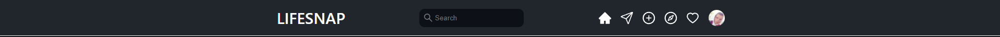
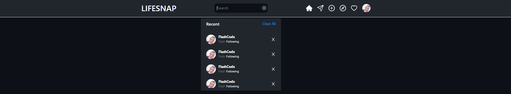
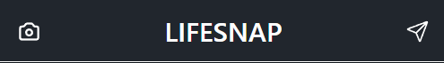
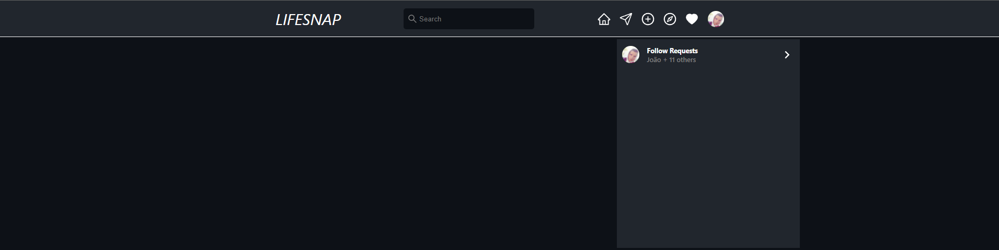
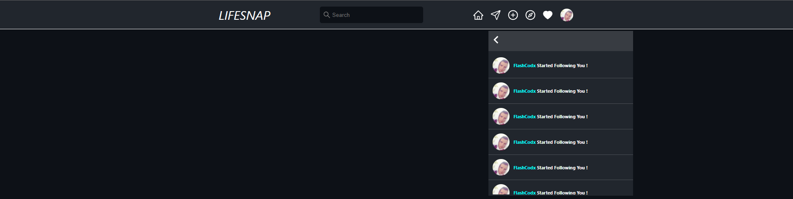
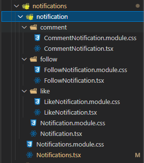
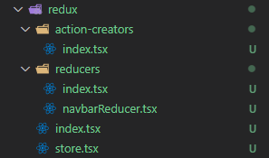
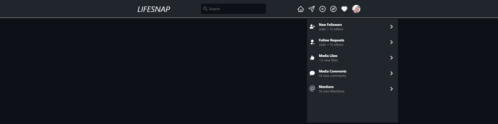

# LifeSnap

A Social Network made with React and Next.

> Current State [In Development]: [https://life-snap.vercel.app/](https://life-snap.vercel.app/)

## Tech

- [React] - HTML enhanced for web apps!
- [Next] - A framework on top of React.
- [CSS Modules] - Used to prevent class overlap.
- [React Icons] - A Icon Library with all the icons i need.

## License

MIT

**Free Software, Hell Yeah!**

[react]: https://reactjs.org/
[next]: https://nextjs.org/

## Development timeline:

### 15/04/2022

- Added a Navbar Component with a search option, total reponsive, with react hooks.

# 

# 

# 

### 16/04/2022

- Created a notification generator with an interface and a enumerator.
- Added a subsections for the follow requests.
- Created components for likes, comments and follows.

# 

# 

# 

### 17/04/2022

- Changed the notification UI into sections.
- Implemented redux.
- Added functionality to navbar with global state managment.

# 

# 
